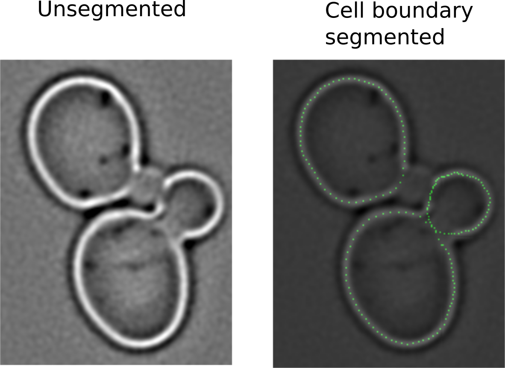

## matlab
This repository contains several matlab script files I have accumulated over the years. An interesting one is the `cell_boundary` folder which contains scripts that automatically segments the cell boundaries of yeast cells.

To run it, enter `cell_boundary.m` and navigate to the folder containing the test image. The folder includes a test image which you should see the results of the segmentation as below.

 `calcium_channels` contains code used to model frequency response of calcium channels in smooth muscle cells.

`tube_vesselness` contains an implementation of a 'tubeness' filter that segments tube like structures, such as newly formed blood vessels well.
