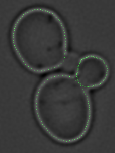

## matlab
This repository contains several matlab script files I have accumulated over the years. An interesting one is the `cell_boundary` folder which contains scripts that automatically segments the cell boundaries of yeast cells.

To run it, run `cell_boundary.m` and navigate to the folder containing the test image. The folder includes a test image which you should see the results of the segmentation as below.

